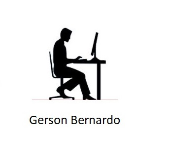

# Sistema Pessoal

## Índice

- <a href="#funcionalidades">Funcionalidades do Projeto</a>
- <a href="#layout">Layout</a>
- <a href="#ideias-a-ser-utilizada">Idéias a ser utilizada</a>

### Funcionalidades do Projeto

### Layout

### Ideias a ser utilizada

- [x] LINGUAGEM DE PROGRAMAÇÃO JAVASCRIPT
- [ ] TAREFAS COM BANCO DE DADOS EM MYSQL
- [ ] PROJETOS COM BANCO DE DADOS EM MYSQL
- [ ] MOVIMENTAÇÃO FINANCEIRA COM BANCO DE DADOS EM POSTGRESQL
- [ ] AGENDA DE ORAÇÃO COM BANCO DE DADOS EM SQL SERVER
- [ ] ESTUDOS BÍBLICOS COM BANCO EM MICROSOFT ACCESS

### Aprendizado

| DATA       | DESCRIÇÃO                                                              | Situação     |
| ---------- | ---------------------------------------------------------------------- | ------------ |
| 25/10/2025 | APRENDER A FAZER UM README PARA APRESENTAÇÃO DO TRABALHO NO **GITHUB** | Em Andamento |
|            |                                                                        |
|            |                                                                        |
|            |                                                                        |
|            |                                                                        |

### Desenvolvimento

| DATA | DESCRIÇÃO | STATUS |
| ---: | --------- | ------ |
|      |           |        |
|      |           |        |
|      |           |        |
|      |           |        |
|      |           |        |

#### AUTOR

